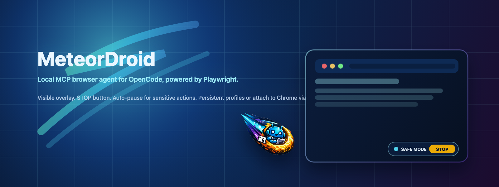

<p align="center">
  
</p>

<h1 align="center">MeteorDroid</h1>

<p align="center">
  A small, local <strong>MCP server</strong> that gives <a href="https://opencode.ai">OpenCode</a>
  a real browser to drive (Chromium via <a href="https://playwright.dev">Playwright</a>)
  with a visible safety overlay and a built-in pause/handoff protocol.
</p>

<p align="center">
  <a href="#quick-install"></a>
  
  
  <a href="LICENSE"></a>
</p>

```text
OpenCode  --MCP/stdio-->  MeteorDroid (this repo)  --Playwright-->  Chromium
                                |                              |
                                |                              + Visible safety overlay + STOP
                                + Auto-pause + human handoff on sensitive steps
```

## Quick Install

MeteorDroid is a standard **MCP stdio server**, so it works with OpenCode and any other MCP host that can spawn a local command over stdio.

Install from npm:

```bash
npm i -g meteordroid
```

Entry point for MCP hosts (global install):

```jsonc
{
  "command": ["meteordroid"],
  "environment": {
    "MINI_COMET_MODE": "persistent",
    "MINI_COMET_PROFILE_DIR": "/Users/you/.minicomet/profile"
  }
}
```

Or run via `npx` (no global install):

```jsonc
{
  "command": ["npx", "-y", "meteordroid"],
  "environment": {
    "MINI_COMET_MODE": "persistent",
    "MINI_COMET_PROFILE_DIR": "/Users/you/.minicomet/profile"
  }
}
```

## Why MeteorDroid?

- A real, visible browser (not a silent headless bot)
- Auto-pause on sensitive actions (sign in/up, submit/enter, purchases, destructive flows)
- Three session modes: `ephemeral`, `persistent`, or attach to your real Chrome via `cdp`
- Multi-tab read with a single write target to reduce "oops wrong tab" failures
- File uploads via `browser_upload_file`

## What's new in v0.4

- **`browser_upload_file`** — upload one or more local files to a file input.
  Targets the `<input type=file>` directly OR a nearby drop-zone / button
  (the tool walks up to find the closest hidden file input). Handles the
  common SPA pattern where the visible button is decorative and the real
  input is `display:none`.
- **Smart locator with fallback chain.** Plain-English targets are now tried
  in this order: explicit selector syntax → `role+name` (button/link/textbox/
  checkbox/tab/menuitem) → label → placeholder → alt text → title → text. The
  winning strategy is returned in every click/type/wait_for result so you can
  see (and one day record) which lookup style worked.
- **`browser_wait_for`** — wait until an element matching selector_or_text
  reaches a state (`visible` / `hidden` / `attached` / `detached`). Cuts the
  guesswork out of SPA transitions.
- **`browser_dom_summary`** — compact JSON of visible interactive elements
  (`{tag, role, name, type?, id?, placeholder?}`). Much cheaper than
  `get_page_text` when you just need to know "what can I click or fill?".
- **Overlay polish.** Pill moved to bottom-right (out of common notification
  badge zones), bigger STOP button, amber border flash on every write, and
  the last action label now lingers for ~1.8s after returning to idle so
  you can read what just happened.

## What was in v0.3

- **Visible safety overlay** with pulsing pill + STOP button.
- **Animated fake cursor** (blue→orange while typing, red while clicking).
- **Keyboard-first form filling**: `browser_focus_next`, `browser_focus_prev`,
  `browser_type_into_focused`.
- **`browser_evaluate`** for one-off DOM probing.

## What was in v0.2

- **Three session modes** — ephemeral, persistent (logins survive), or attach
  to your real Chrome via CDP.
- **Multi-tab read, single-tab write.**
- **Auto-pause + manual resume handoff.**

---

## Tools

### Navigation & I/O
| Tool | Purpose |
|---|---|
| `browser_open_url` | Navigate the active tab. |
| `browser_get_page_text` | Compact readable text of the active tab. |
| `browser_dom_summary` | JSON list of visible interactive elements. |
| `browser_click` | Click by selector OR visible text. *Auto-pauses on sensitive targets.* |
| `browser_type` | Fill a field by selector / label / placeholder. |
| `browser_press` | Press a key. *`Enter` auto-pauses.* |
| `browser_type_into_focused` | Type into whatever element has focus (no selector needed). |
| `browser_focus_next` / `browser_focus_prev` | Tab / Shift+Tab the focus ring. |
| `browser_upload_file` | Upload local file paths to a file input (direct or via nearby drop-zone). |
| `browser_wait_for` | Wait until selector/text becomes visible/hidden/attached/detached. |
| `browser_evaluate` | Run a JS expression in the page; returns the result (truncated). |
| `browser_screenshot` | PNG of the active viewport. |
| `browser_close` | Close agent-owned tabs (CDP: leaves your Chrome running). |

### Multi-tab
| Tool | Purpose |
|---|---|
| `browser_list_tabs` | List every tab with `{index, title, url, isActive, isAgent}`. |
| `browser_read_tab` | Read-only text extraction from any tab by index. |
| `browser_set_active_tab` | Make a different tab the write target (cross-origin requires `confirm:true`). |
| `browser_new_tab` | Open a new agent-marked tab. |

### Handoff
| Tool | Purpose |
|---|---|
| `browser_request_human` | Voluntarily pause and ask the user to take over. |
| `browser_resume` | Clear the pause after the user finishes the manual step. |
| `browser_status` | Mode, paused state + reason, active URL. |

All write tools are gated on the pause flag and return a structured
`{paused, reason, hint}` observation when blocked. Read tools work while
paused so the agent can verify the new state on resume.

---

## Quick Start

```bash
npm install
npm run typecheck
```

Requires Node >= 18.17.

### Add to OpenCode

Use the included `opencode.jsonc` as a starting point. Example:

```jsonc
{
  "$schema": "https://opencode.ai/config.json",
  "mcp": {
    "browser-agent": {
      "type": "local",
      "command": ["npx", "tsx", "/abs/path/to/src/server.ts"],
      "environment": {
        "MINI_COMET_MODE": "persistent",
        "MINI_COMET_PROFILE_DIR": "/Users/you/.minicomet/profile"
      },
      "enabled": true
    }
  }
}
```

---

## Configuration — three session modes

Set `MINI_COMET_MODE` in your OpenCode MCP `environment` block.

### Mode 1: `ephemeral` (default — like v0.1)

Fresh isolated Chromium. No cookies survive between runs. Best for safe,
self-contained tasks (scraping public sites, smoke tests).

```jsonc
{
  "$schema": "https://opencode.ai/config.json",
  "mcp": {
    "browser-agent": {
      "type": "local",
      "command": ["npx", "tsx", "/abs/path/opencode-browser-agent/src/server.ts"],
      "environment": { "MINI_COMET_MODE": "ephemeral" },
      "enabled": true
    }
  }
}
```

### Mode 2: `persistent` — recommended default

Playwright stores cookies/localStorage in a directory. Log in once manually,
the agent uses your session forever after. Different profile dir per use case
recommended (one for dev tools, one for social, etc.).

```jsonc
{
  "mcp": {
    "browser-agent": {
      "type": "local",
      "command": ["npx", "tsx", "/abs/path/opencode-browser-agent/src/server.ts"],
      "environment": {
        "MINI_COMET_MODE": "persistent",
        "MINI_COMET_PROFILE_DIR": "/Users/you/.minicomet/profile-social",
        "MINI_COMET_HEADLESS": "0"
      },
      "enabled": true
    }
  }
}
```

The first time you launch, you'll get a clean Chromium. Log in to whichever
sites you want; the agent will reuse those sessions on every subsequent run.

### Mode 3: `cdp` — attach to your real Chrome

Connect MeteorDroid to the Chrome you already use, with all your extensions and
logins. The agent creates a new tab marked `[mc]` and only writes to that tab,
but can *read* any of your other open tabs.

**Step 1.** Launch your Chrome with debugging enabled. On macOS:

```bash
/Applications/Google\ Chrome.app/Contents/MacOS/Google\ Chrome \
  --remote-debugging-port=9222 \
  --user-data-dir=$HOME/.minicomet/chrome-cdp
```

Alternatively, MeteorDroid ships a small helper that can prompt you to pick an
existing Chrome profile directory and launch Chrome in the background:

```bash
meteordroid cdp
```

(This uses your existing Chrome `--user-data-dir` and selected
`--profile-directory`, so you must fully quit Chrome first.)

(Use a separate `--user-data-dir` so this doesn't conflict with your normal
Chrome. Or omit it to use your default profile — at your own risk.)

**Step 2.** Configure OpenCode:

```jsonc
{
  "mcp": {
    "browser-agent": {
      "type": "local",
      "command": ["npx", "tsx", "/abs/path/opencode-browser-agent/src/server.ts"],
      "environment": {
        "MINI_COMET_MODE": "cdp",
        "MINI_COMET_CDP_URL": "http://localhost:9222"
      },
      "enabled": true
    }
  }
}
```

When OpenCode disconnects, the agent's `[mc]` tabs close but **your Chrome
keeps running**.

### All env vars

| Variable | Default | Used in |
|---|---|---|
| `MINI_COMET_MODE` | `ephemeral` | always |
| `MINI_COMET_HEADLESS` | `0` | ephemeral, persistent |
| `MINI_COMET_PROFILE_DIR` | `~/.minicomet/profile` | persistent |
| `MINI_COMET_CDP_URL` | `http://localhost:9222` | cdp |
| `MINI_COMET_TAB_MARKER` | `[mc]` | always |

---

## The handoff protocol

When the agent calls `browser_click("Sign up")`:

1. Server matches the safety pattern `/\bsign\s*(in|up)\b/`.
2. Server flips `paused=true` with reason and returns:
   ```json
   {"paused": true, "reason": "Click \"Sign up\" matches sensitive pattern...",
    "hint": "Tell the user to complete this step in the visible browser, then ask them to say 'resume'."}
   ```
3. The LLM in OpenCode tells you what's needed, e.g.:
   > 🙋 I've paused before clicking "Sign up". Please complete the signup
   > (including any 2FA / CAPTCHA) in the `[mc]` tab, then tell me "resume".
4. You do the manual step. The browser is *yours* during this time —
   click, type, switch tabs, whatever you need.
5. You say "resume" in OpenCode. The LLM calls `browser_resume`.
6. The LLM calls `browser_get_page_text` to see the new state and continues.

Every write tool is hard-blocked between steps 2 and 5. The LLM cannot
"forget" and proceed.

### Sensitive patterns that auto-pause

```
place order, buy now, pay now, confirm purchase, complete payment,
sign in, sign up, log in, create account, register, submit,
delete account, wipe, destroy
```

Plus pressing the **Enter** key. To explicitly authorize one of these, the
agent must be told to call with `confirm: true` — and even then *only* when
you've explicitly approved that specific action.

---

## Multi-tab workflow example

Scenario: 4 reference tabs open, agent should write a summary into a 5th.

```
User: "I have 4 articles open. Open a new tab to docs.google.com,
       create a doc, and summarize what's in tabs 0-3 into it."

LLM:
  → browser_list_tabs()
    ← {tabs:[{index:0,title:"Article A"},
            {index:1,title:"Article B"},
            {index:2,title:"Article C"},
            {index:3,title:"Article D"}]}
  → browser_read_tab({index:0, max_chars:3000})
  → browser_read_tab({index:1, max_chars:3000})
  → browser_read_tab({index:2, max_chars:3000})
  → browser_read_tab({index:3, max_chars:3000})
  → browser_new_tab({url:"https://docs.google.com/document/u/0/create"})
    ← {paused:true, reason:"...sign in..."}    # if not logged in
  [user logs in, says "resume"]
  → browser_resume()
  → browser_type({selector_or_text:"Document content", text:"## Summary..."})
```

The agent never tries to write to tabs 0–3; only the marked `[mc]` tab.

---

## MVP smoke tests

```bash
npm install
npx playwright install chromium
npm run smoke:v4   # v0.4: upload, smart locator, wait_for, dom_summary
npm run smoke:v3   # v0.3: overlay, STOP, focused-typing, evaluate
npm run smoke:v2   # v0.2: multi-tab + pause/resume
npm run smoke      # v0.1: single-tab MVP
```

Each prints a sequence of ✓ checks ending in `ALL CHECKS PASSED`.

---

## Layout

```
opencode-browser-agent/
├── package.json
├── tsconfig.json
├── README.md
├── opencode.jsonc            # example config
├── src/
│   ├── server.ts             # MCP stdio server
│   ├── browser.ts            # Session: 3 modes, tabs, pause/resume
│   └── tools.ts              # Tool schemas, descriptors, dispatcher, safety
└── scripts/
    ├── smoke.ts              # v0.1 single-tab MVP test
    ├── smoke-v2.ts           # v0.2 multi-tab + pause/resume test
    ├── smoke-v3.ts           # v0.3 overlay/STOP/focused-typing test
    ├── smoke-v4.ts           # v0.4 upload/locator/wait_for/dom_summary
    └── fixtures/
        └── upload-page.html  # v0.4 local fixture
```

---

## Limitations / honest caveats

- The auto-pause regex is a heuristic, not a security boundary. A site that
  uses an unusual button label can slip through. Read the page text and
  decide critically before pressing `confirm:true`.
- In `cdp` mode the agent *could* call `browser_set_active_tab` onto a
  sensitive tab. The cross-origin `confirm:true` guard mitigates this but
  doesn't eliminate it. **Run `cdp` mode with a dedicated user-data-dir.**
- This tool will not bypass CAPTCHAs, SMS verification, or any anti-abuse
  challenge — and that's deliberate. Those exist to ensure a human is
  present, and the handoff protocol respects that.

## License

MIT.
